Applied Exercises of Chapter 9
================

-   [Question 4](#question-4)
-   [Question 5](#question-5)
-   [Question 6](#question-6)
    -   [6a](#a)
    -   [6b](#b)
    -   [6c](#c)
    -   [6d](#d)
-   [Question 7](#question-7)
    -   [7a](#a-1)
    -   [7b](#b-1)
    -   [7c](#c-1)
    -   [7d](#d-1)
-   [Question 8](#question-8)
    -   [8a](#a-2)
    -   [8b](#b-2)
    -   [8c](#c-2)
    -   [8d](#d-2)
    -   [8e](#e)
    -   [8f](#f)
    -   [8g](#g)
    -   [8h](#h)

Question 4
==========

Generate a simulated two-class data set with 100 observations and two features in which there is a visible but non-linear separation between the two classes. Show that in this setting, a support vector machine with a polynomial kernel (with degree greater than 1) or a radial kernel will outperform a support vector classifier on the training data. Which technique performs best on the test data? Make plots and report training and test error rates in order to back up your assertions.

Generate data and plot:

``` r
set.seed(1)
transl <- 3
X <- matrix(rnorm(100 * 2), ncol = 2)
X[1:30, ] <- X[1:30, ] + transl
X[31:60, ] <- X[31:60, ] - transl
y <- c(rep(0, 60), rep(1, 40))
dat <- data.frame(x = X, y = as.factor(y))
plot(X, col = y + 1)
```

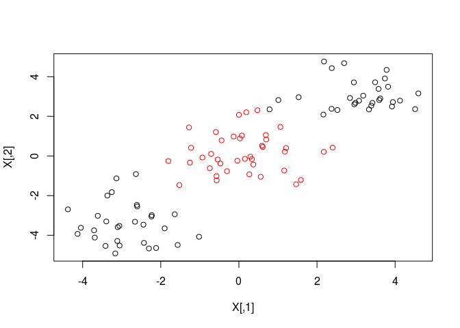

Split to training and test set:

``` r
train <- sample(100, 80)
dat.train <- dat[train, ]
dat.test <- dat[-train, ]
```

Fit with a support vector classifier and describe the model:

``` r
library(e1071)
svm.lin <- svm(y ~ ., data = dat.train, kernel = 'linear', scale = FALSE)
plot(svm.lin, data = dat.train)
```

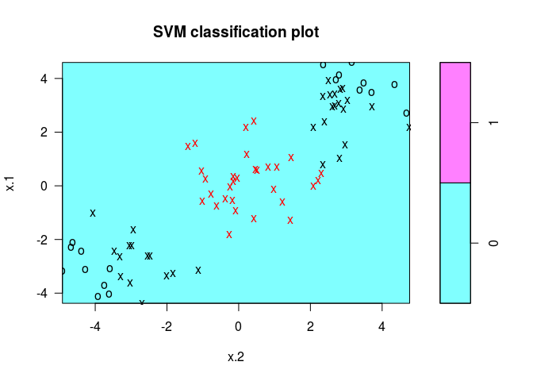

``` r
summary(svm.lin)
```

    ## 
    ## Call:
    ## svm(formula = y ~ ., data = dat.train, kernel = "linear", scale = FALSE)
    ## 
    ## 
    ## Parameters:
    ##    SVM-Type:  C-classification 
    ##  SVM-Kernel:  linear 
    ##        cost:  1 
    ##       gamma:  0.5 
    ## 
    ## Number of Support Vectors:  62
    ## 
    ##  ( 30 32 )
    ## 
    ## 
    ## Number of Classes:  2 
    ## 
    ## Levels: 
    ##  0 1

Calculate the training error of the support vector classifier:

``` r
table(predict = svm.lin$fitted, truth = dat.train$y)
```

    ##        truth
    ## predict  0  1
    ##       0 50 30
    ##       1  0  0

The error rate: $\\frac{33}{47 + 33} = 41.25%$.

The support vector classifier marks all training points as class *zero*, which means this model is useless on this training set.

Fit with polynomial kernel and calculate the training error rate:

``` r
svm.poly <- svm(y ~ ., data = dat.train, kernel = 'polynomial', scale = FALSE)
plot(svm.poly, data = dat.train)
```

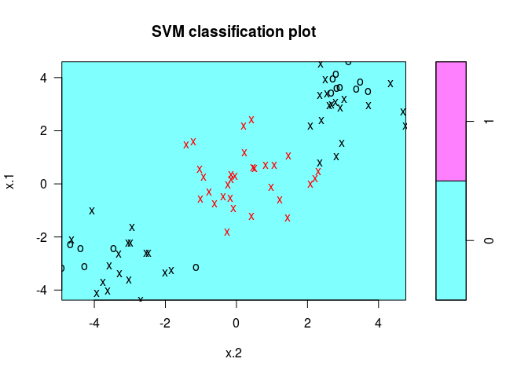

``` r
table(predict = svm.poly$fitted, truth = dat.train$y)
```

    ##        truth
    ## predict  0  1
    ##       0 50 30
    ##       1  0  0

There are 2 correct prediction.

Fit with radial kernel and calculate the traing error rate:

``` r
svm.rad <- svm(y ~ ., data = dat.train, kernel = 'radial', scale = FALSE)
plot(svm.rad, data = dat.train)
```

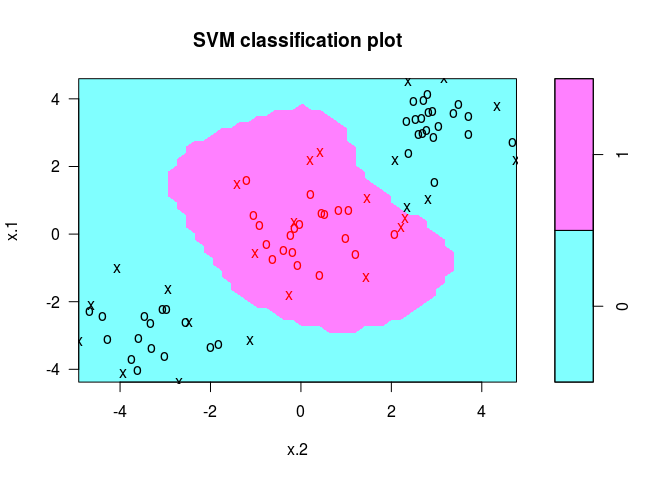

``` r
table(predict = svm.rad$fitted, truth = dat.train$y)
```

    ##        truth
    ## predict  0  1
    ##       0 49  0
    ##       1  1 30

The error rate is $\\frac{1}{1 + 46 + 33} = 1.25%$, which much more less than the other 2 kernels.

Compare the test errors of the 3 kernels:

``` r
lin.pred <- predict(svm.lin, dat.test)
table(predict = lin.pred, truth = dat.test$y)
```

    ##        truth
    ## predict  0  1
    ##       0 10 10
    ##       1  0  0

``` r
poly.pred <- predict(svm.poly, dat.test)
table(predict = poly.pred, truth = dat.test$y)
```

    ##        truth
    ## predict  0  1
    ##       0 10 10
    ##       1  0  0

``` r
rad.pred <- predict(svm.rad, dat.test)
table(predict = rad.pred, truth = dat.test$y)
```

    ##        truth
    ## predict  0  1
    ##       0 10  0
    ##       1  0 10

The test error rate for linear, polynomial (with default degree: 3) and radial kernel are: 35%, 35% and 0.

Question 5
==========

We have seen that we can fit an SVM with a non-linear kernel in order to perform classification using a non-linear decision boundary. We will now see that we can also obtain a non-linear decision boundary by performing logistic regression using non-linear transformations of the features.

1.  Generate a data set with n = 500 and p = 2, such that the observations belong to two classes with a quadratic decision boundary between them:

``` r
set.seed(1)
x1 <- runif(500) - 0.5
x2 <- runif(500) - 0.5
y <- as.integer(x1 ^ 2 - x2 ^ 2 > 0)
```

两类的分界线是 *x*<sub>1</sub><sup>2</sup> − *x*<sub>2</sub><sup>2</sup> = 0，也就是 *x* = ±*y*，4个象限的角平分线，边界是直线而不是二次曲线。

1.  Plot the observations, colored according to their class labels. Your plot should display X 1 on the x-axis, and X 2 on the y-axis:

``` r
plot(x1[y == 0], x2[y == 0], col = "red", xlab = "X1", ylab = "X2")
points(x1[y == 1], x2[y == 1], col = "blue")
```

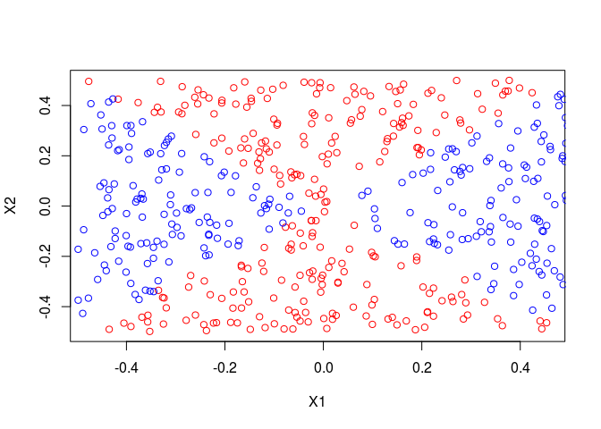

1.  Fit a logistic regression model to the data, using *X*<sub>1</sub> and *X*<sub>2</sub> as predictors.

``` r
dat <- data.frame(x1 = x1, x2 = x2, y = as.factor(y))
lr.fit <- glm(y ~ ., data = dat, family = 'binomial')
```

1.  Apply this model to the *training data* in order to obtain a predicted class label for each training observation. Plot the observations, colored according to the predicted class labels. The decision boundary should be linear.

``` r
lr.prob <- predict(lr.fit, newdata = dat, type = 'response')
lr.pred <- ifelse(lr.prob > 0.5, 1, 0)
plot(dat$x1, dat$x2, col = lr.pred + 2)
```

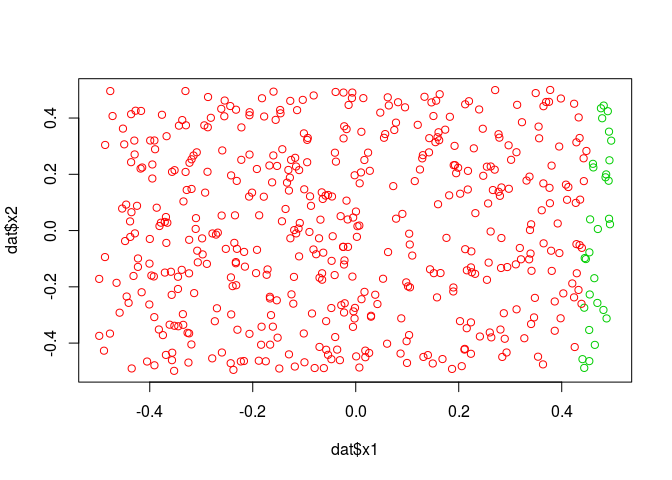

边界是线性的，但即使在训练集上，预测结果误差仍然非常大，表明线性逻辑回归不适于这个数据集。

1.  Now fit a logistic regression model to the data using non-linear functions of *X*<sub>1</sub> and *X*<sub>2</sub> as predictors (e.g. *X*<sub>1</sub><sup>2</sup> , *X*<sub>1</sub> × *X*<sub>2</sub>, *l**o**g*(*X*<sub>2</sub>), and so forth).

``` r
lr.nl <- glm(y ~ poly(x1, 2) + poly(x2, 2), data = dat, family = 'binomial')
```

    ## Warning: glm.fit: algorithm did not converge

    ## Warning: glm.fit: fitted probabilities numerically 0 or 1 occurred

``` r
summary(lr.nl)
```

    ## 
    ## Call:
    ## glm(formula = y ~ poly(x1, 2) + poly(x2, 2), family = "binomial", 
    ##     data = dat)
    ## 
    ## Deviance Residuals: 
    ##        Min          1Q      Median          3Q         Max  
    ## -1.079e-03  -2.000e-08  -2.000e-08   2.000e-08   1.297e-03  
    ## 
    ## Coefficients:
    ##               Estimate Std. Error z value Pr(>|z|)
    ## (Intercept)     -94.48    2963.78  -0.032    0.975
    ## poly(x1, 2)1   3442.52  104411.28   0.033    0.974
    ## poly(x1, 2)2  30110.74  858421.66   0.035    0.972
    ## poly(x2, 2)1    162.82   26961.99   0.006    0.995
    ## poly(x2, 2)2 -31383.76  895267.48  -0.035    0.972
    ## 
    ## (Dispersion parameter for binomial family taken to be 1)
    ## 
    ##     Null deviance: 6.9218e+02  on 499  degrees of freedom
    ## Residual deviance: 4.2881e-06  on 495  degrees of freedom
    ## AIC: 10
    ## 
    ## Number of Fisher Scoring iterations: 25

1.  Apply this model to the training data in order to obtain a predicted class label for each training observation. Plot the observations, colored according to the predicted class labels. The decision boundary should be obviously non-linear. If it is not, then repeat (a)-(e) until you come up with an example in which the predicted class labels are obviously non-linear.

``` r
lr.prob.nl <- predict(lr.nl, newdata = dat, type = 'response')
lr.pred.nl <- ifelse(lr.prob.nl > 0.5, 1, 0)
plot(dat$x1, dat$x2, col = lr.pred.nl + 2)
```

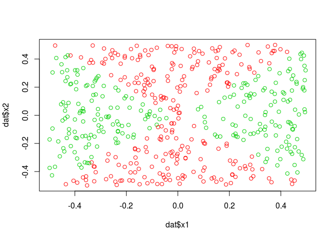

The predictions are much better than linear model.

1.  Fit a support vector classifier to the data with *X*<sub>1</sub> and *X*<sub>2</sub> as predictors. Obtain a class prediction for each training observation. Plot the observations, colored according to the predicted class labels.

``` r
svm.lin <- svm(y ~ ., data = dat, kernel = 'linear', cost = 0.01)
plot(svm.lin, dat)
```

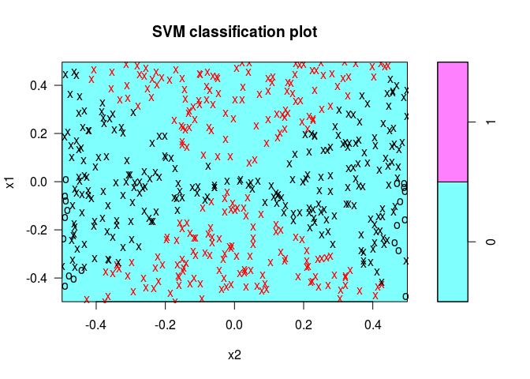

1.  Fit a SVM using a non-linear kernel to the data. Obtain a class prediction for each training observation. Plot the observations, colored according to the predicted class labels.

``` r
svm.nl <- svm(y ~ ., data = dat, kernel = 'radial', gamma = 1)
plot(svm.nl, data = dat)
```

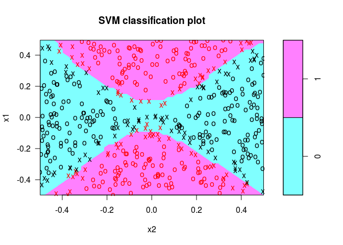

1.  Comment on your results.

线性逻辑回归处理非线性边界效果很差，SVM线性核使用小 cost 时效果尚可，非线性逻辑回归和SVM处理非线性边界效果都很好。

Question 6
==========

At the end of Section 9.6.1, it is claimed that in the case of data that is just barely linearly separable, a support vector classifier with a small value of cost that misclassifies a couple of training observations may perform better on test data than one with a huge value of cost that does not misclassify any training observations. You will now investigate this claim.

6a
--

Generate two-class data with p = 2 in such a way that the classes are just barely linearly separable.

``` r
set.seed(1)
obs = 1000
x1 <- runif(obs, min = -4, max = 4)
x2 <- runif(obs, min = -1, max = 16)
y <- ifelse(x2 > x1 ^ 2, 0, 1)
dat <- data.frame(x1 = x1, x2 = x2, y = as.factor(y))
train <- sample(obs, obs/2)
dat.train <- dat[train, ]
dat.test <- dat[-train, ]
par(mfrow = c(1,2))
plot(dat.train$x1, dat.train$x2, col = as.integer(dat.train$y) + 1, main = 'training set')
plot(dat.test$x1, dat.test$x2, col = as.integer(dat.test$y) + 1, main = 'test set')
```

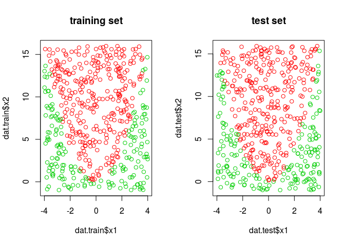

6b
--

Compute the cross-validation error rates for support vector classifiers with a range of cost values. How many training errors are misclassified for each value of cost considered, and how does this relate to the cross-validation errors obtained?

``` r
set.seed(1)
cost.grid <- c(0.001, 0.01, 0.1, 1, 5, 10, 100, 10000)
tune.out <- tune(svm, y ~., data = dat.train, kernel = 'linear', ranges = list(cost = cost.grid))
summary(tune.out)
```

    ## 
    ## Parameter tuning of 'svm':
    ## 
    ## - sampling method: 10-fold cross validation 
    ## 
    ## - best parameters:
    ##  cost
    ##   0.1
    ## 
    ## - best performance: 0.24 
    ## 
    ## - Detailed performance results:
    ##    cost error dispersion
    ## 1 1e-03 0.370 0.05517648
    ## 2 1e-02 0.248 0.05977736
    ## 3 1e-01 0.240 0.05416026
    ## 4 1e+00 0.244 0.05641119
    ## 5 5e+00 0.244 0.05641119
    ## 6 1e+01 0.244 0.05641119
    ## 7 1e+02 0.244 0.05641119
    ## 8 1e+04 0.270 0.06749486

Training errors of the models with different *cost* value:

``` r
err.rate.train <- rep(NA, length(cost.grid))
for (cost in cost.grid) {
  svm.fit <- svm(y ~ ., data = dat.train, kernel = 'linear', cost = cost)
  plot(svm.fit, data = dat.train)
  res <- table(prediction = predict(svm.fit, newdata = dat.train), truth = dat.train$y)
  err.rate.train[match(cost, cost.grid)] <- (res[2,1] + res[1,2]) / sum(res)
}
```

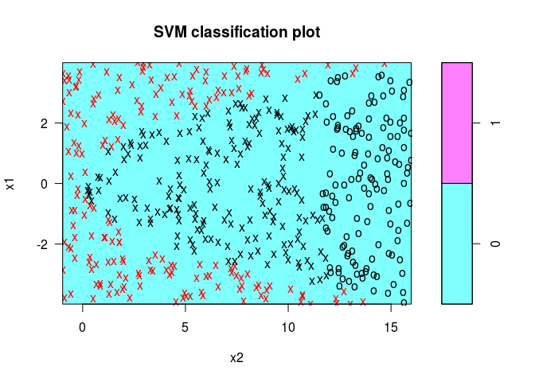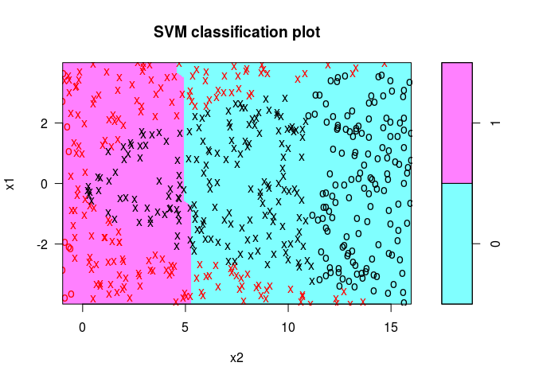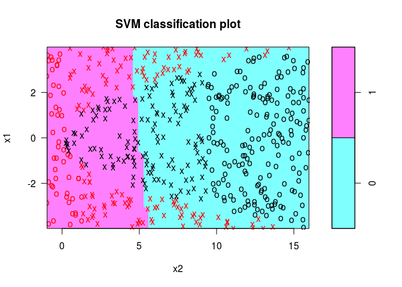

``` r
err.rate.train
```

    ## [1] 0.370 0.240 0.246 0.246 0.244 0.244 0.244 0.244

``` r
paste('The cost', cost.grid[which.min(err.rate.train)], 'has the minimum training error:', min(err.rate.train))
```

    ## [1] "The cost 0.01 has the minimum training error: 0.24"

最优结果与 cross-validation 结果不一致。 随着 *cost* 变大，training error 应该降低，但这里有升有降，原因尚不清楚。

6c
--

Generate an appropriate test data set, and compute the test errors corresponding to each of the values of cost considered. Which value of cost leads to the fewest test errors, and how does this compare to the values of cost that yield the fewest training errors and the fewest cross-validation errors?

``` r
err.rate.test <- rep(NA, length(cost.grid))
for (cost in cost.grid) {
  svm.fit <- svm(y ~ ., data = dat.train, kernel = 'linear', cost = cost)
  res <- table(prediction = predict(svm.fit, newdata = dat.test), truth = dat.test$y)
  err.rate.test[match(cost, cost.grid)] <- (res[2,1] + res[1,2]) / sum(res)
}
err.rate.test
```

    ## [1] 0.384 0.232 0.230 0.230 0.232 0.232 0.232 0.232

``` r
paste('The cost', cost.grid[which.min(err.rate.test)], 'has the minimum test error:', min(err.rate.test))
```

    ## [1] "The cost 0.1 has the minimum test error: 0.23"

最优结果与 cross-validation 结果一致，都是 cost = 0.1 时最优。

6d
--

Discuss your results.

线性 kernel 拟合非线性边界时，cost 较小时 training error 和 test error 都比较小，但如果 cost 太小，由于 margin 过宽导致失去分类作用，见 `cost = 0.001` 时的模型图。

总体来说，这种情况下无论如何调整 cost 错误率都比较高，所以当使用不同 cost 后错误率无明显变化一直很高，可能是 kernel 选择不当导致的。

Question 7
==========

In this problem, you will use support vector approaches in order to predict whether a given car gets high or low gas mileage based on the Auto data set.

7a
--

Create a binary variable that takes on a 1 for cars with gas mileage above the median, and a 0 for cars with gas mileage below the median.

``` r
library(ISLR)
mileage.median <- median(Auto$mpg)
Auto$mb <- ifelse(Auto$mpg > mileage.median, 1, 0)
```

7b
--

Fit a support vector classifier to the data with various values of cost, in order to predict whether a car gets high or low gas mileage. Report the cross-validation errors associated with different values of this parameter. Comment on your results.

``` r
cost.grid <- c(0.001, 0.1, 1, 100)
set.seed(1)
tune.res <- tune(svm, mb ~ . - mpg, data = Auto, kernel = 'linear', ranges = list(cost = cost.grid))
summary(tune.res)
```

    ## 
    ## Parameter tuning of 'svm':
    ## 
    ## - sampling method: 10-fold cross validation 
    ## 
    ## - best parameters:
    ##  cost
    ##     1
    ## 
    ## - best performance: 0.09129186 
    ## 
    ## - Detailed performance results:
    ##    cost      error dispersion
    ## 1 1e-03 0.10861464 0.02815681
    ## 2 1e-01 0.10078133 0.04430714
    ## 3 1e+00 0.09129186 0.03486337
    ## 4 1e+02 0.11413712 0.03453277

`cost = 1` has the lowest error rate.

7c
--

Now repeat (b), this time using SVMs with radial and polynomial basis kernels, with different values of *gamma* and *degree* and *cost*. Comment on your results.

*cost* and *gamma* in *radial* kernel:

``` r
cost.grid <- c(0.01, 0.1, 1, 10, 100)
gamma.grid <- c(0.5, 1, 2, 3, 4)
tune.radial <- tune(svm, mb ~ ., data = Auto, kernel = 'radial', ranges = list(cost = cost.grid, gamma = gamma.grid))
summary(tune.radial)
```

    ## 
    ## Parameter tuning of 'svm':
    ## 
    ## - sampling method: 10-fold cross validation 
    ## 
    ## - best parameters:
    ##  cost gamma
    ##     1   0.5
    ## 
    ## - best performance: 0.0494452 
    ## 
    ## - Detailed performance results:
    ##     cost gamma      error dispersion
    ## 1  1e-02   0.5 0.40894884 0.04580611
    ## 2  1e-01   0.5 0.08049627 0.02145866
    ## 3  1e+00   0.5 0.04944520 0.01577709
    ## 4  1e+01   0.5 0.05105067 0.01576364
    ## 5  1e+02   0.5 0.05103145 0.01575272
    ## 6  1e-02   1.0 0.48094134 0.04663955
    ## 7  1e-01   1.0 0.29823301 0.04925304
    ## 8  1e+00   1.0 0.09747304 0.01936442
    ## 9  1e+01   1.0 0.09937784 0.02034672
    ## 10 1e+02   1.0 0.09937784 0.02034672
    ## 11 1e-02   2.0 0.49740491 0.04644036
    ## 12 1e-01   2.0 0.43112161 0.05199100
    ## 13 1e+00   2.0 0.20816385 0.01493330
    ## 14 1e+01   2.0 0.20859325 0.01513708
    ## 15 1e+02   2.0 0.20859325 0.01513708
    ## 16 1e-02   3.0 0.49884416 0.04624527
    ## 17 1e-01   3.0 0.44388768 0.05049454
    ## 18 1e+00   3.0 0.23225338 0.01226836
    ## 19 1e+01   3.0 0.23233516 0.01220982
    ## 20 1e+02   3.0 0.23233516 0.01220982
    ## 21 1e-02   4.0 0.49927372 0.04611473
    ## 22 1e-01   4.0 0.44755153 0.04903225
    ## 23 1e+00   4.0 0.23704063 0.01045309
    ## 24 1e+01   4.0 0.23705712 0.01042354
    ## 25 1e+02   4.0 0.23705712 0.01042354

*cost* and *degree* in *polynomial* kernel:

``` r
deg.grid <- c(1, 2, 3, 4)
tune.degree <- tune(svm, mb ~ ., data = Auto, kernel = 'polynomial', ranges = list(cost = cost.grid, degree = deg.grid))
summary(tune.degree)
```

    ## 
    ## Parameter tuning of 'svm':
    ## 
    ## - sampling method: 10-fold cross validation 
    ## 
    ## - best parameters:
    ##  cost degree
    ##   100      1
    ## 
    ## - best performance: 0.074606 
    ## 
    ## - Detailed performance results:
    ##     cost degree      error dispersion
    ## 1  1e-02      1 0.46734598 0.03038117
    ## 2  1e-01      1 0.12793619 0.01782819
    ## 3  1e+00      1 0.08658607 0.01910636
    ## 4  1e+01      1 0.08093351 0.02158074
    ## 5  1e+02      1 0.07460600 0.02241969
    ## 6  1e-02      2 0.53028413 0.03204003
    ## 7  1e-01      2 0.52830399 0.03195528
    ## 8  1e+00      2 0.50885257 0.03218225
    ## 9  1e+01      2 0.35786854 0.05463216
    ## 10 1e+02      2 0.23775032 0.05758297
    ## 11 1e-02      3 0.53040607 0.03204928
    ## 12 1e-01      3 0.52962074 0.03207716
    ## 13 1e+00      3 0.52163536 0.03248782
    ## 14 1e+01      3 0.44722520 0.03975769
    ## 15 1e+02      3 0.20538767 0.04683606
    ## 16 1e-02      4 0.53049209 0.03204616
    ## 17 1e-01      4 0.53048044 0.03204555
    ## 18 1e+00      4 0.53036394 0.03203947
    ## 19 1e+01      4 0.52917103 0.03200847
    ## 20 1e+02      4 0.51730311 0.03244410

7d
--

Make some plots to back up your assertions in (b) and (c).

``` r
plot(tune.radial$best.model, Auto, mpg ~ horsepower)
```

Why there's no output?

Question 8
==========

This problem involves the OJ data set which is part of the *ISLR* package.

8a
--

Create a training set containing a random sample of 800 observations, and a test set containing the remaining observations:

``` r
library(ISLR)
set.seed(1)
train <- sample(nrow(OJ), 800)
dat.train <- OJ[train, ]
dat.test <- OJ[-train, ]
```

8b
--

Fit a support vector classifier to the training data using *cost=0.01*, with *Purchase* as the response and the other variables as predictors. Use the `summary()` function to produce summary statistics, and describe the results obtained.

``` r
svc <- svm(Purchase ~ ., data = dat.train, kernel = 'linear', cost = 0.01)
summary(svc)
```

    ## 
    ## Call:
    ## svm(formula = Purchase ~ ., data = dat.train, kernel = "linear", 
    ##     cost = 0.01)
    ## 
    ## 
    ## Parameters:
    ##    SVM-Type:  C-classification 
    ##  SVM-Kernel:  linear 
    ##        cost:  0.01 
    ##       gamma:  0.05555556 
    ## 
    ## Number of Support Vectors:  432
    ## 
    ##  ( 215 217 )
    ## 
    ## 
    ## Number of Classes:  2 
    ## 
    ## Levels: 
    ##  CH MM

There are 432 support vectors in 800 observations, 215 for class *CH* and 217 for class *MM*.

8c
--

What are the training and test error rates?

Training error:

``` r
train.pred <- predict(svc, newdata = dat.train)
table(predict = train.pred, truth = dat.train$Purchase)
```

    ##        truth
    ## predict  CH  MM
    ##      CH 439  78
    ##      MM  55 228

The training error rate: 78 + 55/800 = 0.166.

``` r
test.pred <- predict(svc, newdata = dat.test)
table(predict = test.pred, truth = dat.test$Purchase)
```

    ##        truth
    ## predict  CH  MM
    ##      CH 141  31
    ##      MM  18  80

Test error rate: 18 + 31/270 = 0.1815.

8d
--

Use the tune() function to select an optimal *cost*. Consider values in the range 0.01 to 10.

``` r
set.seed(1)
tune.svc <- tune(svm, Purchase ~ ., data = OJ, kernel = "linear", ranges = list(cost = c(0.01, 0.1, 1, 10)))
summary(tune.svc)
```

    ## 
    ## Parameter tuning of 'svm':
    ## 
    ## - sampling method: 10-fold cross validation 
    ## 
    ## - best parameters:
    ##  cost
    ##    10
    ## 
    ## - best performance: 0.1672897 
    ## 
    ## - Detailed performance results:
    ##    cost     error dispersion
    ## 1  0.01 0.1719626 0.02929012
    ## 2  0.10 0.1719626 0.02380682
    ## 3  1.00 0.1757009 0.02561346
    ## 4 10.00 0.1672897 0.02767155

``` r
summary(tune.svc$best.model)
```

    ## 
    ## Call:
    ## best.tune(method = svm, train.x = Purchase ~ ., data = OJ, ranges = list(cost = c(0.01, 
    ##     0.1, 1, 10)), kernel = "linear")
    ## 
    ## 
    ## Parameters:
    ##    SVM-Type:  C-classification 
    ##  SVM-Kernel:  linear 
    ##        cost:  10 
    ##       gamma:  0.05555556 
    ## 
    ## Number of Support Vectors:  442
    ## 
    ##  ( 223 219 )
    ## 
    ## 
    ## Number of Classes:  2 
    ## 
    ## Levels: 
    ##  CH MM

So the radial kernel with cost = 10 is the optimal model.

8e
--

Compute the training and test error rates using this new value for *cost*.

``` r
train.pred <- predict(tune.svc$best.model, newdata = dat.train)
table(predict = train.pred, truth = dat.train$Purchase)
```

    ##        truth
    ## predict  CH  MM
    ##      CH 438  72
    ##      MM  56 234

``` r
test.pred <- predict(tune.svc$best.model, newdata = dat.test)
table(predict = test.pred, truth = dat.test$Purchase)
```

    ##        truth
    ## predict  CH  MM
    ##      CH 141  26
    ##      MM  18  85

The training and test errors are: (72 + 56)/800 = 0.16 and (26 + 18)/270 = 0.163.

8f
--

Repeat parts (b) through (e) using a support vector machine with a radial kernel. Use the default value for *gamma*.

``` r
tune.radial <- tune(svm, Purchase ~ ., data = OJ, kernel = "radial", ranges = list(cost = c(0.01, 0.1, 1, 10)))
summary(tune.radial)
```

    ## 
    ## Parameter tuning of 'svm':
    ## 
    ## - sampling method: 10-fold cross validation 
    ## 
    ## - best parameters:
    ##  cost
    ##     1
    ## 
    ## - best performance: 0.1719626 
    ## 
    ## - Detailed performance results:
    ##    cost     error dispersion
    ## 1  0.01 0.3897196 0.04558304
    ## 2  0.10 0.1794393 0.05907515
    ## 3  1.00 0.1719626 0.05290450
    ## 4 10.00 0.1850467 0.05740884

``` r
summary(tune.radial$best.model)
```

    ## 
    ## Call:
    ## best.tune(method = svm, train.x = Purchase ~ ., data = OJ, ranges = list(cost = c(0.01, 
    ##     0.1, 1, 10)), kernel = "radial")
    ## 
    ## 
    ## Parameters:
    ##    SVM-Type:  C-classification 
    ##  SVM-Kernel:  radial 
    ##        cost:  1 
    ##       gamma:  0.05555556 
    ## 
    ## Number of Support Vectors:  485
    ## 
    ##  ( 245 240 )
    ## 
    ## 
    ## Number of Classes:  2 
    ## 
    ## Levels: 
    ##  CH MM

``` r
train.pred <- predict(tune.radial$best.model, newdata = dat.train)
table(predict = train.pred, truth = dat.train$Purchase)
```

    ##        truth
    ## predict  CH  MM
    ##      CH 453  80
    ##      MM  41 226

``` r
test.pred <- predict(tune.radial$best.model, newdata = dat.test)
table(predict = test.pred, truth = dat.test$Purchase)
```

    ##        truth
    ## predict  CH  MM
    ##      CH 144  28
    ##      MM  15  83

The training and test error: (80 + 41)/800 = 0.15, and (28 + 15)/270 = 0.159.

8g
--

Repeat parts (b) through (e) using a support vector machine with a polynomial kernel. Set `degree = 2`

``` r
tune.poly <- tune(svm, Purchase ~ ., data = OJ, kernel = "polynomial", degree = 2, ranges = list(cost = c(0.01, 0.1, 1, 10)))
summary(tune.poly)
```

    ## 
    ## Parameter tuning of 'svm':
    ## 
    ## - sampling method: 10-fold cross validation 
    ## 
    ## - best parameters:
    ##  cost
    ##    10
    ## 
    ## - best performance: 0.1691589 
    ## 
    ## - Detailed performance results:
    ##    cost     error dispersion
    ## 1  0.01 0.3700935 0.05216557
    ## 2  0.10 0.3018692 0.04039046
    ## 3  1.00 0.1990654 0.03917066
    ## 4 10.00 0.1691589 0.03591348

``` r
summary(tune.poly$best.model)
```

    ## 
    ## Call:
    ## best.tune(method = svm, train.x = Purchase ~ ., data = OJ, ranges = list(cost = c(0.01, 
    ##     0.1, 1, 10)), kernel = "polynomial", degree = 2)
    ## 
    ## 
    ## Parameters:
    ##    SVM-Type:  C-classification 
    ##  SVM-Kernel:  polynomial 
    ##        cost:  10 
    ##      degree:  2 
    ##       gamma:  0.05555556 
    ##      coef.0:  0 
    ## 
    ## Number of Support Vectors:  450
    ## 
    ##  ( 230 220 )
    ## 
    ## 
    ## Number of Classes:  2 
    ## 
    ## Levels: 
    ##  CH MM

``` r
train.pred <- predict(tune.poly$best.model, newdata = dat.train)
table(predict = train.pred, truth = dat.train$Purchase)
```

    ##        truth
    ## predict  CH  MM
    ##      CH 451  74
    ##      MM  43 232

``` r
test.pred <- predict(tune.poly$best.model, newdata = dat.test)
table(predict = test.pred, truth = dat.test$Purchase)
```

    ##        truth
    ## predict  CH  MM
    ##      CH 147  29
    ##      MM  12  82

The training and test error: (74 + 43)/800 = 0.146, and (29 + 12)/270 = 0.152.

8h
--

Overall, which approach seems to give the best results on this data?

The polynomial kernel with `cost = 10` and `degree = 2` give the best results (lowest training and test errors).
